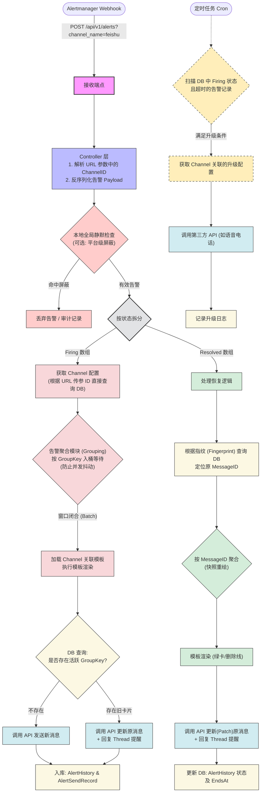

# alert

## 告警流程



## DispatchAlert

```go
func DispatchAlert(db *gorm.DB, incomingAlert AlertHistory) error {
	// 1. 获取所有启用的路由规则（按优先级排序）
	var rules[]model.AlertRouteRule
	db.Preload("Channels"). // 重点：把关联的发送渠道一起查出来
		Where("status = ?", 1).
		Order("priority DESC").
		Find(&rules)

	// 2. 遍历规则，看这个告警符合哪个规则
	for _, rule := range rules {
		// 解析规则的匹配条件
		var conditions[]configs.MatchCondition
		json.Unmarshal(rule.MatchConditions, &conditions)

		// 检查告警标签是否满足所有条件
		if isMatch(incomingAlert.Labels, conditions) {

			// 3. 一旦匹配成功，获取绑定的发送渠道并发送
			for _, channel := range rule.Channels {
				// 调用之前讨论的通知器工厂发送告警
				notifier := notifier.BuildNotifier(channel.Type, channel.Config)
				notifier.Send(incomingAlert.Alertname, "告警详情...")
			}

			// 匹配到一条规则并发送后，通常可以选择停止匹配后续规则（防止重复发送）
			break
		}
	}
	return nil
}

// isMatch 函数实现标签匹配逻辑
func isMatch(alertLabelsJSON datatypes.JSON, conditions []configs.MatchCondition) bool {
    // 逻辑：将 alertLabels 解析为 map[string]string
    // 遍历 conditions，检查 map 中对应 key 的 value 是否满足 Operator 和 Value 的要求
    // 全部满足返回 true，否则返回 false
    return true
}
```

## 飞书卡片

```go
package configs

// FeishuCardMsg 飞书卡片消息的外层结构
type FeishuCardMsg struct {
	MsgType string     `json:"msg_type"` // 固定值: "interactive"
	Card    FeishuCard `json:"card"`
}

type FeishuCard struct {
	Config   FeishuCardConfig    `json:"config"`
	Header   FeishuCardHeader    `json:"header"`
	Elements[]FeishuCardElement `json:"elements"`
}

type FeishuCardConfig struct {
	WideScreenMode bool `json:"wide_screen_mode"` // 宽屏模式
}

type FeishuCardHeader struct {
	Template string `json:"template"` // 颜色：red, green, blue 等
	Title    struct {
		Content string `json:"content"`
		Tag     string `json:"tag"` // "plain_text"
	} `json:"title"`
}

type FeishuCardElement struct {
	Tag     string `json:"tag"`     // "markdown", "div" 等
	Content string `json:"content"` // Markdown 文本内容
}

package notifier

import (
	"bytes"
	"encoding/json"
	"strings"
	"text/template"
	"time"

	"your_project/model"
	"your_project/configs"
)

// 定义模板支持的自定义函数（比如把 firing 变成大写）
var tplFuncs = template.FuncMap{
	"ToUpper": strings.ToUpper,
}

// RenderAndSendFeishu 渲染模板并组装飞书卡片发送
func RenderAndSendFeishu(alert model.AlertHistory, tpl model.AlertTemplate, webhookURL string) error {
	// 1. 编译并渲染 Title
	titleT, err := template.New("title").Funcs(tplFuncs).Parse(tpl.TitleTpl)
	if err != nil {
		return err
	}
	var titleBuf bytes.Buffer
	titleT.Execute(&titleBuf, alert)

	// 2. 编译并渲染 Body (Markdown内容)
	bodyT, err := template.New("body").Funcs(tplFuncs).Parse(tpl.BodyTpl)
	if err != nil {
		return err
	}
	var bodyBuf bytes.Buffer
	bodyT.Execute(&bodyBuf, alert)

	// 3. 决定卡片的颜色 (状态为 firing 用红色，resolved 用绿色)
	headerColor := "red"
	if alert.Status == "resolved" {
		headerColor = "green"
	}

	// 4. 安全地组装飞书结构体 (避免了 JSON 注入)
	feishuMsg := configs.FeishuCardMsg{
		MsgType: "interactive",
		Card: configs.FeishuCard{
			Config: configs.FeishuCardConfig{WideScreenMode: true},
			Header: configs.FeishuCardHeader{
				Template: headerColor, // 动态颜色
				Title: struct {
					Content string `json:"content"`
					Tag     string `json:"tag"`
				}{
					Content: titleBuf.String(), // 注入渲染好的标题
					Tag:     "plain_text",
				},
			},
			Elements:
```
